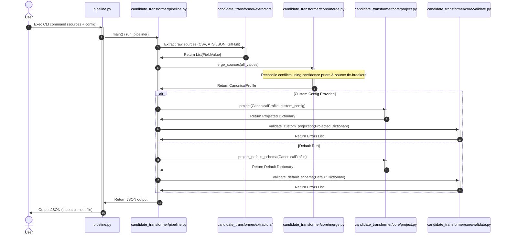

# 🚀 Multi-Source Candidate Data Transformer

[](https://www.python.org/)
[](https://docs.python.org/3/)
[](file:///c:/Users/lokes/Desktop/eightfold-transformer/tests/test_pipeline.py)

Built for the **Eightfold Engineering Intern (Jul–Dec 2026)** assignment, this project is a robust, lightweight, and deterministic pipeline that ingests candidate profile data from inconsistent, multi-source inputs (e.g., recruiter CSV exports, ATS JSON blobs, GitHub public profiles) and transforms them into a single, clean, canonical candidate profile.

Every field in the output profile is traceable to its source with computed confidence scores and detailed provenance records, ensuring complete transparency and auditability.

---

## 📖 Table of Contents
1. [Project Overview](#-project-overview)
2. [Tech Stack](#-tech-stack)
3. [System Execution Flow](#-system-execution-flow)
4. [Code Structure & Organization](#-code-structure--organization)
5. [Setup & Installation](#-setup--installation)
6. [How to Run](#-how-to-run)
7. [Running Tests](#-running-tests)
8. [Pipeline Architecture & Design](#-pipeline-architecture--design)

---

## 🌟 Project Overview

Integrating multiple candidate data sources is a major challenge in modern recruitment platforms. The hard part is not reading files or APIs, but resolving **who wins when two sources disagree** on a field (e.g., different phone numbers or job titles) and doing so consistently and explainably.

### Key Features
* **Per-Field Confidence Priors**: Confidence is calculated *per field, per source* (e.g., recruiter CSV is authoritative for contact numbers, whereas GitHub is authoritative for technical skills) rather than a single average score per source.
* **Deterministic Tie-Breaking**: Reconciles conflicts deterministically using strict confidence values and source priority fallbacks.
* **Comprehensive Provenance**: Records every decision, capturing which sources provided which values, which values won, and which values were discarded or merged.
* **Flexible Projection ("The Required Twist")**: Separates the internal canonical record from the custom output structure using a runtime configuration layer.

---

## 🛠️ Tech Stack

* **Language**: [Python 3.9+](https://www.python.org/)
* **Dependencies**: **None** (Built exclusively using the Python Standard Library to ensure zero-dependency overhead, high security, and easy auditability).
* **Core Modules Used**:
  * `csv`, `json`, `io`: For parsing input sources.
  * `dataclasses`: For structuring typed schemas and data payloads.
  * `re`, `unicodedata`: For text cleanup, email validation, phone and date normalization.
  * `argparse`: For providing a CLI interface.

---

## 🔄 System Execution Flow

The system runs a unidirectional pipeline: **Parse ➔ Extract ➔ Merge ➔ Project ➔ Validate ➔ Output**.



---

## 📂 Code Structure & Organization

The codebase is organized into a clean, modular package structure to separate concerns and support scalability:

```bash
eightfold-transformer/
├── README.md               # Visual landing page & quickstart
├── architecture.md         # High-level architecture, design decisions & priors
├── projectdocumentation.md  # Detailed module breakdown, flowcharts & integration specs
├── pipeline.py             # Root-level CLI entry point wrapper
├── Rama_Lokesh_Reddy_Penumallu_rlpreddy565@gmail.com_Eightfold.pdf # Technical Design Document (Step 1)
├── candidate_transformer/  # Main package

│   ├── __init__.py
│   ├── pipeline.py         # Orchestrator logic (run_pipeline, CLI parser main)
│   ├── core/               # Core merging and projection engine
│   │   ├── __init__.py
│   │   ├── schema.py       # Data structures, provenance models & confidence scores
│   │   ├── merge.py        # Conflict resolution & confidence aggregation logic
│   │   ├── project.py      # Configuration-driven projection engine
│   │   └── validate.py     # Pre-output schema validation checks
│   ├── extractors/         # Data source extractors (separated by concern)
│   │   ├── __init__.py     # Exposes extractor functions
│   │   ├── csv_extractor.py # Extract recruiter CSV data
│   │   ├── ats_extractor.py # Extract ATS JSON data
│   │   └── github_extractor.py # Extract GitHub API profile/repo data
│   └── utils/              # Normalization and helper utilities
│       ├── __init__.py
│       └── normalize.py    # Field cleanups (emails, phones, dates, and skills)
├── tests/                  # Test suite
│   ├── __init__.py
│   └── test_pipeline.py    # Core validation unit tests
└── sample_inputs/          # Test data assets
    ├── ats.json            # Mock ATS JSON export
    ├── recruiter.csv       # Mock Recruiter CSV export
    ├── github_profile.json # Mock GitHub API profile
    ├── github_repos.json   # Mock GitHub repos JSON
    └── custom_config.json  # Sample output projection config
```

---

## 💻 Setup & Installation

Since the project uses only the Python standard library, there are **no dependencies to install**. 

### Prerequisites
* Python 3.9 or higher. Verify your installation with:
  ```bash
  python --version
  # or
  python3 --version
  ```

### Getting Started
1. Clone or copy this repository to your local machine:
   ```bash
   git clone https://github.com/ramalokeshreddyp/Candidate-Data-Transformer.git
   cd Candidate-Data-Transformer
   ```

---

## 🚀 How to Run

The pipeline runs as a CLI tool via `pipeline.py`. 

### 1. Default Schema Output
Run the pipeline using the mock data provided in `sample_inputs/` to generate the default canonical profile structure:
```bash
python pipeline.py \
  --candidate-id cand_001 \
  --recruiter-csv sample_inputs/recruiter.csv \
  --ats-json sample_inputs/ats.json \
  --github-profile sample_inputs/github_profile.json \
  --github-repos sample_inputs/github_repos.json
```

### 2. Custom Output Projection (The "Required Twist")
To shape the output profile dynamically, supply a projection schema using the `--config` flag:
```bash
python pipeline.py \
  --candidate-id cand_001 \
  --recruiter-csv sample_inputs/recruiter.csv \
  --ats-json sample_inputs/ats.json \
  --github-profile sample_inputs/github_profile.json \
  --github-repos sample_inputs/github_repos.json \
  --config sample_inputs/custom_config.json
```
This runs the same internal merge engine, but projects the final JSON structure into custom fields (e.g., mapping `emails[0]` to `primary_email`, filtering skills, and setting normalization rules on-the-fly) as defined by the configuration.

### Saving Output to File
Add the `--out <path>` argument to write the JSON results directly to a file:
```bash
python pipeline.py \
  --candidate-id cand_001 \
  --recruiter-csv sample_inputs/recruiter.csv \
  --out output.json
```

---

## 🧪 Running Tests

A suite of unit tests covers the critical parts of the pipeline's logic (conflict resolution, tie-breaking, schema validation, and normalization).

Run the tests directly as a Python module:
```bash
python -m tests.test_pipeline
```

All 8 tests are executed without needing external test frameworks:
```text
PASS: conflict resolution picks highest confidence, records loser
PASS: ties resolved deterministically by source priority
PASS: multi-value fields union correctly instead of picking one winner
PASS: garbage CSV produces empty extraction, no crash, no invented data
PASS: phone normalization handles common formats and rejects junk
PASS: date normalization covers common formats, refuses to guess on garbage
PASS: on_missing='error' surfaces missing required fields loudly
PASS: GitHub-inferred skills are discounted relative to declared skills

8/8 tests passed
```

---

## 🔗 Project Documentation Links

For deep dives into design, architecture, and code details, refer to:
* **[architecture.md](file:///c:/Users/lokes/Desktop/eightfold-transformer/architecture.md)**: Explore the architectural principles, confidence scoring matrices, and the philosophy behind separating internal canonical records from outputs.
* **[projectdocumentation.md](file:///c:/Users/lokes/Desktop/eightfold-transformer/projectdocumentation.md)**: Explore package module descriptions, code level workflows, data flow diagrams, trade-off evaluations, and integration guidelines for new sources.
