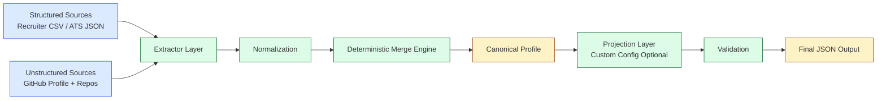
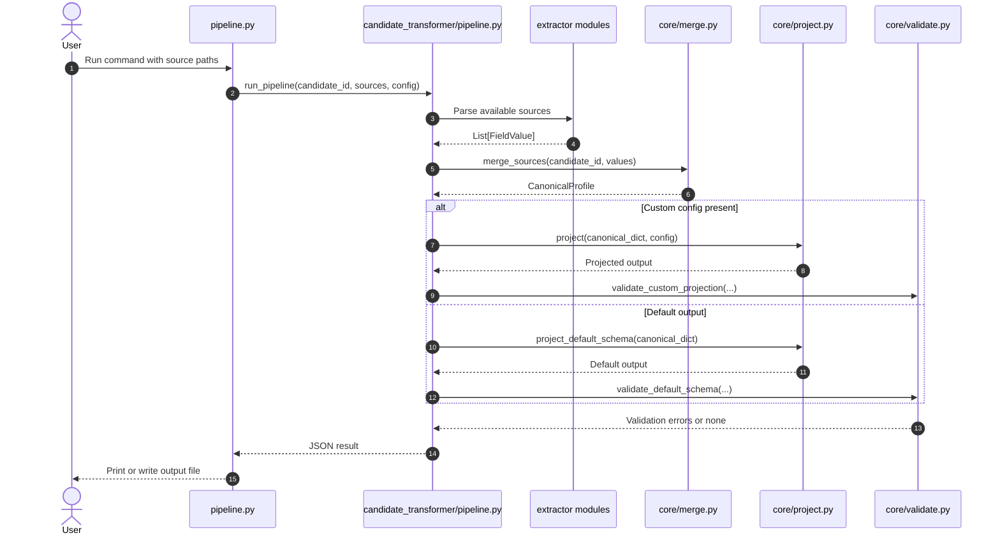
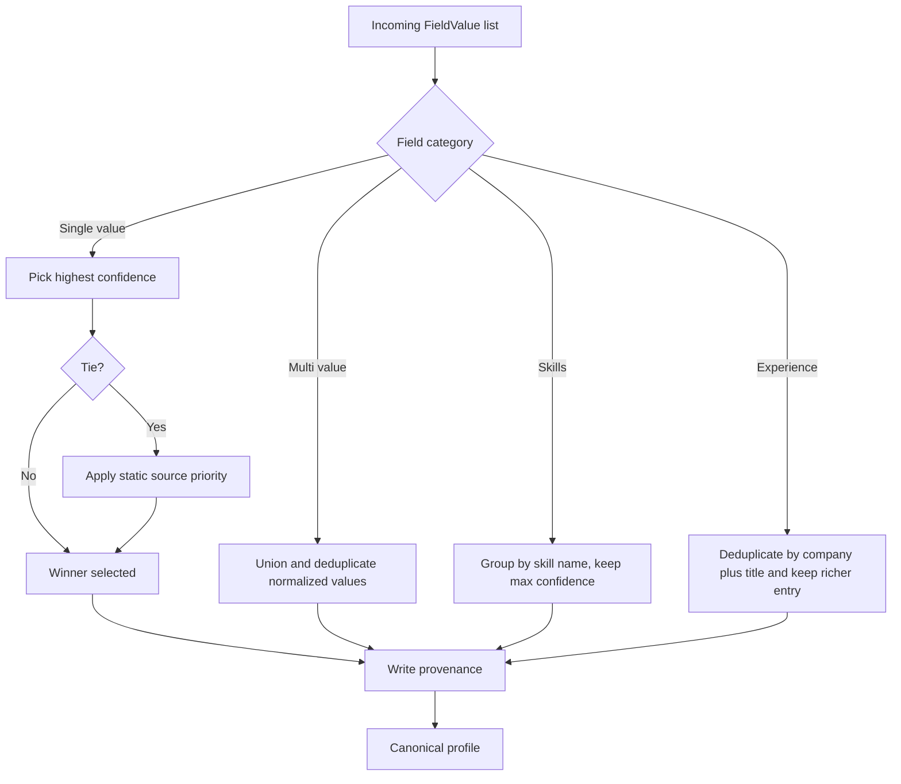

# Multi-Source Candidate Data Transformer

[](https://www.python.org/)
[](https://docs.python.org/3/)
[](tests/test_pipeline.py)
[](architecture.md)

An end-to-end candidate profile transformation engine built for the Eightfold assignment.
The pipeline ingests conflicting multi-source candidate data, normalizes it, resolves conflicts deterministically, records provenance per decision, computes confidence, and returns one trustworthy profile.

## Project Overview

Recruiting systems receive incomplete and conflicting candidate information from multiple channels. This project solves that by enforcing a strict internal canonical record and a runtime output projection layer.

Core outcomes:

1. Deterministic merge decisions for conflicting values.
2. Transparent provenance for every selected field.
3. Confidence scoring per field-source pair.
4. Config-driven output reshaping without code changes.
5. Graceful degradation when a source is missing or malformed.

## Visual System Snapshot



## Tech Stack

| Area | Choice | Why This Choice |
|---|---|---|
| Language | Python 3.9+ | Fast iteration, excellent stdlib support |
| Dependencies | Python standard library only | No install friction, deterministic behavior, easy audit |
| CLI | argparse | Lightweight, built-in, clear execution surface |
| Data parsing | csv, json, io | Reliable parsing for required source formats |
| Modeling | dataclasses, enum | Typed and explicit canonical/internal data model |
| Validation and normalization | re, unicodedata | Predictable formatting and schema checks |
| Tests | built-in test module style | Zero extra framework overhead |

## Workflow Explanation

The runtime workflow follows a strict sequence:

1. Read candidate inputs from CLI arguments.
2. Extract candidate field values from each source.
3. Normalize values into canonical formats.
4. Merge with deterministic conflict policies.
5. Build a canonical profile as source of truth.
6. Apply optional runtime projection config.
7. Validate output shape and field constraints.
8. Emit JSON to stdout or file.

### Execution Sequence Diagram



### Merge Decision Flow



## Code Structure and Folder Organization

```text
eightfold-transformer/
├── README.md                  # Visual landing page & quickstart
├── architecture.md            # High-level architecture, design decisions & priors
├── projectdocumentation.md     # Detailed module breakdown, flowcharts & integration specs
├── pipeline.py                # Root-level CLI entry point wrapper
├── Rama_Lokesh_Reddy_Penumallu_rlpreddy565@gmail.com_Eightfold.pdf # Step 1 Design Document
├── candidate_transformer/     # Main package
│   ├── __init__.py
│   ├── pipeline.py            # Orchestrator logic (run_pipeline, CLI parser main)
│   ├── core/                  # Core merging and projection engine
│   │   ├── __init__.py
│   │   ├── schema.py          # Data structures, provenance models & confidence scores
│   │   ├── merge.py           # Conflict resolution & confidence aggregation logic
│   │   ├── project.py         # Configuration-driven projection engine
│   │   └── validate.py        # Pre-output schema validation checks
│   ├── extractors/            # Data source extractors (separated by concern)
│   │   ├── __init__.py        # Exposes extractor functions
│   │   ├── csv_extractor.py   # Extract recruiter CSV data
│   │   ├── ats_extractor.py   # Extract ATS JSON data
│   │   └── github_extractor.py # Extract GitHub API profile/repo data
│   └── utils/                 # Normalization and helper utilities
│       ├── __init__.py
│       └── normalize.py       # Field cleanups (emails, phones, dates, and skills)
├── tests/                     # Test suite
│   ├── __init__.py
│   └── test_pipeline.py       # Core validation unit and E2E integration tests
└── sample_inputs/             # Test data assets
    ├── ats.json               # Mock ATS JSON export
    ├── recruiter.csv          # Mock Recruiter CSV export
    ├── github_profile.json    # Mock GitHub API profile
    ├── github_repos.json      # Mock GitHub repos JSON
    ├── custom_config.json     # Sample output projection config
    ├── output_default.json    # Generated output for default schema
    └── output_custom_config.json # Generated output for custom config
```

---

## 💻 Setup & Installation

Since the project uses only the Python standard library, there are **no dependencies to install**.

### Prerequisites
* Python 3.9 or higher. Verify your installation with:
  ```bash
  python --version
  # or
  python3 --version
  ```

### Getting Started
1. Clone or copy this repository to your local machine:
   ```bash
   git clone https://github.com/ramalokeshreddyp/Candidate-Data-Transformer.git
   cd Candidate-Data-Transformer
   ```

---

## 🚀 How to Run

The pipeline runs as a CLI tool via `pipeline.py`.

### 1. Default Schema Output
Run the pipeline using the mock data provided in `sample_inputs/` to generate the default canonical profile structure:
```bash
python pipeline.py \
  --candidate-id cand_001 \
  --recruiter-csv sample_inputs/recruiter.csv \
  --ats-json sample_inputs/ats.json \
  --github-profile sample_inputs/github_profile.json \
  --github-repos sample_inputs/github_repos.json
```

To write the default schema output directly to the required deliverable file:
```bash
python pipeline.py \
  --candidate-id cand_001 \
  --recruiter-csv sample_inputs/recruiter.csv \
  --ats-json sample_inputs/ats.json \
  --github-profile sample_inputs/github_profile.json \
  --github-repos sample_inputs/github_repos.json \
  --out sample_inputs/output_default.json
```

### 2. Custom Output Projection (The "Required Twist")
To shape the output profile dynamically, supply a projection schema using the `--config` flag:
```bash
python pipeline.py \
  --candidate-id cand_001 \
  --recruiter-csv sample_inputs/recruiter.csv \
  --ats-json sample_inputs/ats.json \
  --github-profile sample_inputs/github_profile.json \
  --github-repos sample_inputs/github_repos.json \
  --config sample_inputs/custom_config.json
```

To write the custom configuration output directly to the required deliverable file:
```bash
python pipeline.py \
  --candidate-id cand_001 \
  --recruiter-csv sample_inputs/recruiter.csv \
  --ats-json sample_inputs/ats.json \
  --github-profile sample_inputs/github_profile.json \
  --github-repos sample_inputs/github_repos.json \
  --config sample_inputs/custom_config.json \
  --out sample_inputs/output_custom_config.json
```

### Saving Output to File
Add the `--out <path>` argument to write the JSON results directly to a file:
```bash
python pipeline.py \
  --candidate-id cand_001 \
  --recruiter-csv sample_inputs/recruiter.csv \
  --out output.json
```

---

## 🧪 Running Tests

A suite of unit tests covers the critical parts of the pipeline's logic (conflict resolution, tie-breaking, schema validation, and normalization).

Run the tests directly as a Python module:
```bash
python -m tests.test_pipeline
```

All 13 tests are executed successfully without needing external test frameworks:
```text
PASS: conflict resolution picks highest confidence, records loser
PASS: ties resolved deterministically by source priority
PASS: multi-value fields union correctly instead of picking one winner
PASS: garbage CSV produces empty extraction, no crash, no invented data
PASS: phone normalization handles common formats and rejects junk
PASS: date normalization covers common formats, refuses to guess on garbage
PASS: on_missing='error' surfaces missing required fields loudly
PASS: custom projection accepts E.164 normalize token
PASS: default projection emits fixed links shape
PASS: GitHub-inferred skills are discounted relative to declared skills
PASS: validate_default_schema detects malformed location country
PASS: validate_default_schema detects malformed experience date format
PASS: end-to-end pipeline run (default & custom projection)

13/13 tests passed
```

---

## 🔗 Project Documentation Links

For deep dives into design, architecture, and code details, refer to:
* **[architecture.md](file:///c:/Users/lokes/Desktop/eightfold-transformer/architecture.md)**: Explore the architectural principles, confidence scoring matrices, and the philosophy behind separating internal canonical records from outputs.
* **[projectdocumentation.md](file:///c:/Users/lokes/Desktop/eightfold-transformer/projectdocumentation.md)**: Explore package module descriptions, code level workflows, data flow diagrams, trade-off evaluations, and integration guidelines for new sources.
