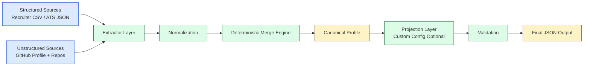
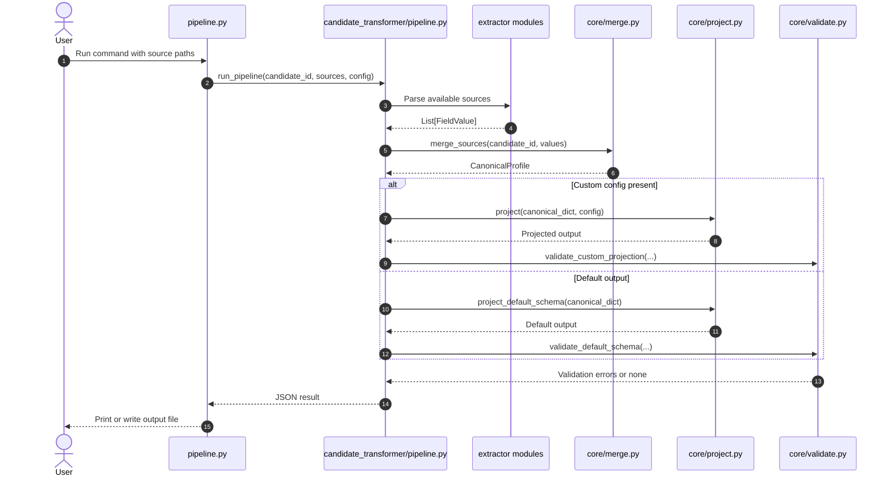
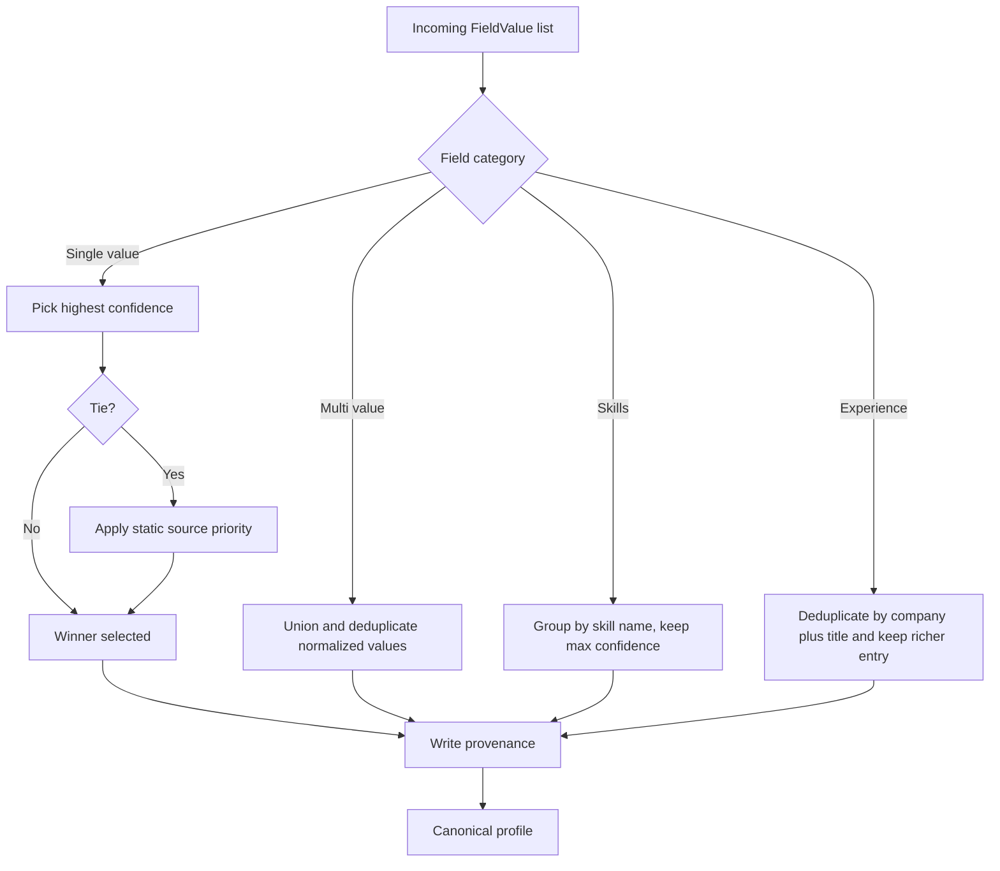

# Multi-Source Candidate Data Transformer

[](https://www.python.org/)
[](https://docs.python.org/3/)
[](tests/test_pipeline.py)
[](architecture.md)

An end-to-end candidate profile transformation engine built for the Eightfold assignment.
The pipeline ingests conflicting multi-source candidate data, normalizes it, resolves conflicts deterministically, records provenance per decision, computes confidence, and returns one trustworthy profile.

## Project Overview

Recruiting systems receive incomplete and conflicting candidate information from multiple channels. This project solves that by enforcing a strict internal canonical record and a runtime output projection layer.

Core outcomes:

1. Deterministic merge decisions for conflicting values.
2. Transparent provenance for every selected field.
3. Confidence scoring per field-source pair.
4. Config-driven output reshaping without code changes.
5. Graceful degradation when a source is missing or malformed.

## Visual System Snapshot



## Tech Stack

| Area | Choice | Why This Choice |
|---|---|---|
| Language | Python 3.9+ | Fast iteration, excellent stdlib support |
| Dependencies | Python standard library only | No install friction, deterministic behavior, easy audit |
| CLI | argparse | Lightweight, built-in, clear execution surface |
| Data parsing | csv, json, io | Reliable parsing for required source formats |
| Modeling | dataclasses, enum | Typed and explicit canonical/internal data model |
| Validation and normalization | re, unicodedata | Predictable formatting and schema checks |
| Tests | built-in test module style | Zero extra framework overhead |

## Workflow Explanation

The runtime workflow follows a strict sequence:

1. Read candidate inputs from CLI arguments.
2. Extract candidate field values from each source.
3. Normalize values into canonical formats.
4. Merge with deterministic conflict policies.
5. Build a canonical profile as source of truth.
6. Apply optional runtime projection config.
7. Validate output shape and field constraints.
8. Emit JSON to stdout or file.

### Execution Sequence Diagram



### Merge Decision Flow



## Code Structure and Folder Organization

```text
eightfold-transformer/
|-- README.md
|-- architecture.md
|-- projectdocumentation.md
|-- pipeline.py
|-- candidate_transformer/
|   |-- __init__.py
|   |-- pipeline.py
|   |-- core/
|   |   |-- __init__.py
|   |   |-- schema.py
|   |   |-- merge.py
|   |   |-- project.py
|   |   |-- validate.py
|   |-- extractors/
|   |   |-- __init__.py
|   |   |-- csv_extractor.py
|   |   |-- ats_extractor.py
|   |   |-- github_extractor.py
|   |-- utils/
|       |-- __init__.py
|       |-- normalize.py
|-- sample_inputs/
|   |-- recruiter.csv
|   |-- ats.json
|   |-- github_profile.json
|   |-- github_repos.json
|   |-- custom_config.json
|   |-- output_default.json
|   |-- output_custom_config.json
|-- tests/
    |-- __init__.py
    |-- test_pipeline.py
```

## Setup and Installation

### Prerequisites

1. Python 3.9 or newer.
2. Access to the repository directory.

### Local Setup

```bash
git clone <your-repo-url>
cd eightfold-transformer
python --version
```

No package installation is required because the project uses only standard library modules.

## Run Locally

### Default canonical output

```bash
python pipeline.py \
  --candidate-id cand_001 \
  --recruiter-csv sample_inputs/recruiter.csv \
  --ats-json sample_inputs/ats.json \
  --github-profile sample_inputs/github_profile.json \
  --github-repos sample_inputs/github_repos.json
```

### Custom output projection

```bash
python pipeline.py \
  --candidate-id cand_001 \
  --recruiter-csv sample_inputs/recruiter.csv \
  --ats-json sample_inputs/ats.json \
  --github-profile sample_inputs/github_profile.json \
  --github-repos sample_inputs/github_repos.json \
  --config sample_inputs/custom_config.json
```

### Write output to file

```bash
python pipeline.py \
  --candidate-id cand_001 \
  --recruiter-csv sample_inputs/recruiter.csv \
  --ats-json sample_inputs/ats.json \
  --github-profile sample_inputs/github_profile.json \
  --github-repos sample_inputs/github_repos.json \
  --out sample_inputs/output_default.json
```

## Usage Instructions

CLI arguments:

- --candidate-id: Required identifier for the resulting profile.
- --recruiter-csv: Path to recruiter CSV source.
- --ats-json: Path to ATS JSON source.
- --github-profile: Path to GitHub profile JSON source.
- --github-repos: Path to GitHub repositories JSON source.
- --config: Optional custom projection config.
- --out: Optional output JSON file path.

Minimum source coverage in this implementation:

1. Structured: Recruiter CSV and ATS JSON.
2. Unstructured: GitHub profile plus repositories.

## Validation and Testing

Run test suite:

```bash
python -m tests.test_pipeline
```

Current status:

1. 13 of 13 tests passing.
2. Includes end-to-end tests for default schema and custom projection.
3. Includes regression tests for E.164 config token handling and fixed links shape.

## Documentation Map

- architecture.md: high-level architecture, merge policy, confidence model, and trade-offs.
- projectdocumentation.md: module-level implementation details, integration contracts, and execution internals.

## Assignment Artifacts

1. One-page design PDF for Step 1.
2. Runnable codebase for Step 2.
3. Sample outputs in sample_inputs/output_default.json and sample_inputs/output_custom_config.json.
4. Automated tests in tests/test_pipeline.py.
