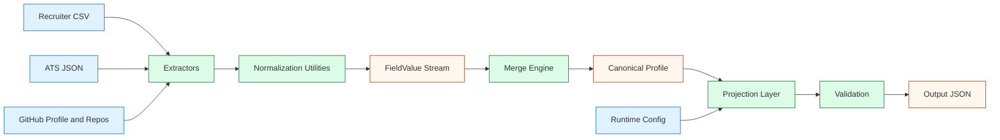
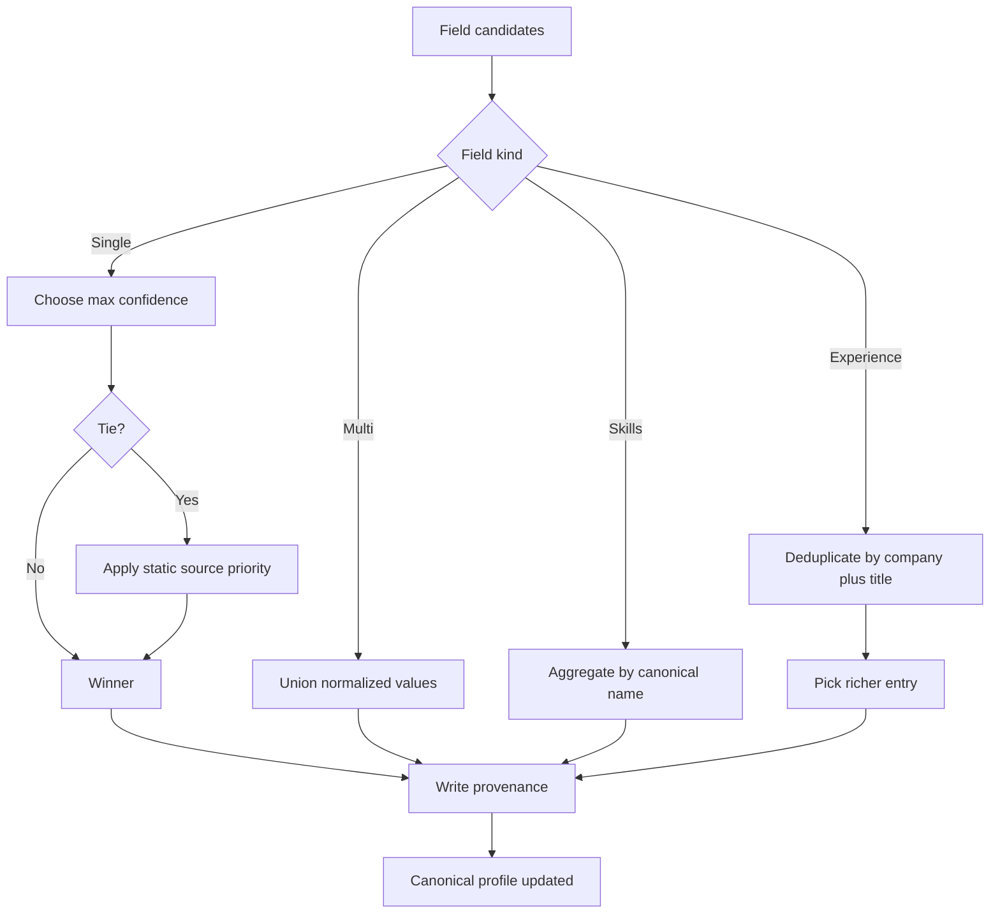
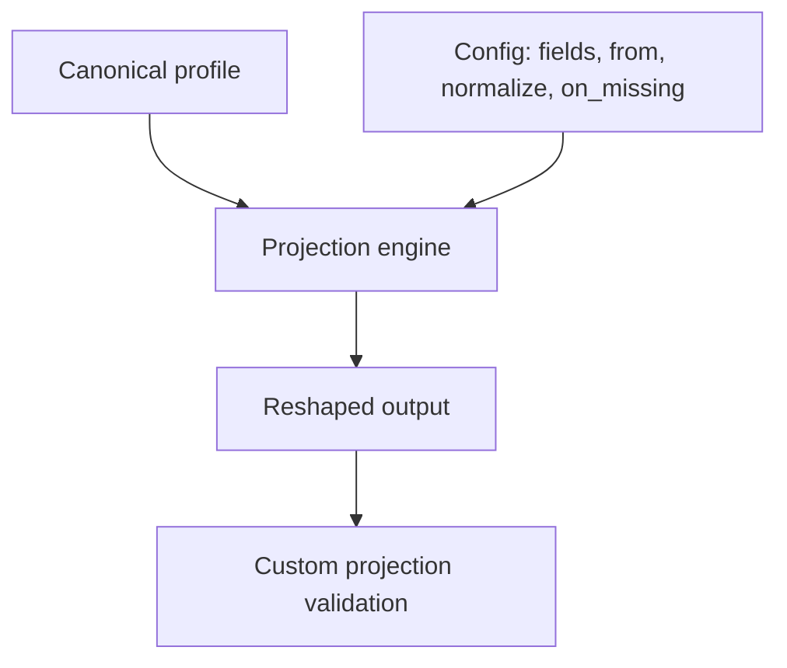
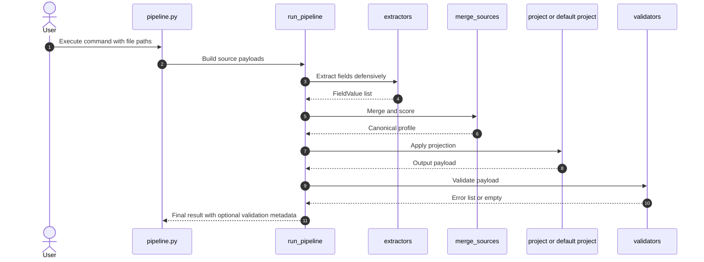

# System Architecture and Design

This document explains the architecture and engineering decisions for the Multi-Source Candidate Data Transformer.
It covers system structure, merge policies, confidence scoring, projection design, data flow, and practical trade-offs.

## Main Idea and Objective

Objective: transform noisy, conflicting, and partially missing candidate data from multiple source types into one canonical and explainable profile.

The architecture is designed to guarantee:

1. Deterministic output for identical inputs.
2. Clear provenance for every selected value.
3. Runtime-configurable output shape without touching merge logic.
4. Graceful handling of malformed or missing sources.

## Design Principles

1. Separation of concerns.
2. Deterministic conflict resolution.
3. Defensive parsing and robustness.
4. Auditable transformations over opaque heuristics.
5. Canonical-first design, projection-second design.

## Architecture Overview

## Canonical Output Schema

The internal canonical profile is the source of truth and remains stable across output formats.

| Field | Type | Notes |
|---|---|---|
| candidate_id | string | required identifier |
| full_name | string or null | single-value winner field |
| emails | string[] | normalized lowercase |
| phones | string[] | E.164 format |
| location | object or null | city, region, country |
| links | object | linkedin, github, portfolio, other[] |
| headline | string or null | profile summary text |
| years_experience | number or null | optional |
| skills | object[] | name, confidence, sources[] |
| experience | object[] | company, title, start, end, summary |
| education | object[] | institution, degree, field, end_year |
| provenance | object[] | field, source, method, confidence |
| overall_confidence | number | aggregate score in [0,1] |

## Normalization Standards

1. Phone: E.164 format.
2. Email: lowercase and regex-validated.
3. Dates: normalized to YYYY-MM where possible.
4. Skills: alias-to-canonical mapping.
5. Text: unicode normalization and whitespace cleanup.

## Merge and Conflict-Resolution Policy

### Single-value fields

Policy:

1. Highest confidence wins.
2. If confidence ties, apply fixed source-priority order.
3. Non-winning values remain visible in provenance as discarded decisions.

### Multi-value fields

Policy:

1. Union values across sources.
2. Deduplicate normalized values.
3. Keep provenance for each retained value.

### Skills

Policy:

1. Group by canonical skill name.
2. Keep max confidence among contributors.
3. Record contributing sources list.

### Experience

Policy:

1. Deduplicate by company plus title key.
2. If collision occurs, select richer record based on non-null attributes.
3. Record duplicate merges in provenance.

### Merge decision visualization

## Confidence Model

Confidence is assigned per field-source pair using base priors and method-specific discounts.

Example strategy:

1. Directly declared values use base field-source prior.
2. Inferred values are discounted.
3. Aggregate overall confidence is computed from accepted decisions only.

### Confidence pipeline

## Runtime Custom-Output Config Design

The projection layer supports dynamic schema reshaping at runtime through config controls:

1. Select a subset of output fields.
2. Map output field from canonical path with from.
3. Apply per-field normalization.
4. Include or exclude confidence and provenance.
5. Configure missing-value behavior as null, omit, or error.

Why this architecture is important:

1. Canonical integrity remains untouched by presentation changes.
2. New client payloads can be supported by config, not merge rewrites.
3. Validation can be applied per projected schema contract.

## Workflow and Execution Flow

## Problem-Solving Approach

1. Isolate extraction from decision logic.
2. Normalize before merge to avoid false conflicts.
3. Encode merge policies explicitly and deterministically.
4. Treat unknown values as null rather than fabricating data.
5. Keep configuration-driven output transformation separate from canonical model.

## Key Components and Integration Details

1. Extractors integrate each source by mapping external fields into FieldValue records.
2. Merge engine integrates all FieldValue records into one canonical profile.
3. Projector integrates runtime config with canonical paths.
4. Validators integrate schema checks before final output.

## Advantages, Benefits, Pros, and Cons

### Advantages

1. Deterministic and explainable output.
2. Strong auditability through provenance.
3. Clear separation between data truth and output shape.
4. Low operational complexity due to zero external dependencies.

### Limitations

1. Rule-based normalization can miss complex natural-language cases.
2. Confidence priors are heuristic and need empirical tuning at scale.
3. In-memory processing is suitable for assignment scale but not distributed-scale ingest.

## Edge Cases and Handling Strategy

1. Missing source file: skip source, continue processing.
2. Malformed source payload: catch extraction exception, continue processing.
3. Conflicting values with equal confidence: resolve by source priority.
4. Ambiguous date text: return null, do not invent.
5. Required projected field missing with on_missing=error: raise explicit projection error.

## Future Evolution

1. Add resume and LinkedIn extractors.
2. Replace heuristic phone parsing with robust regional parsing library.
3. Introduce external skill taxonomy for higher canonicalization quality.
4. Add batch processing mode for large candidate sets.
