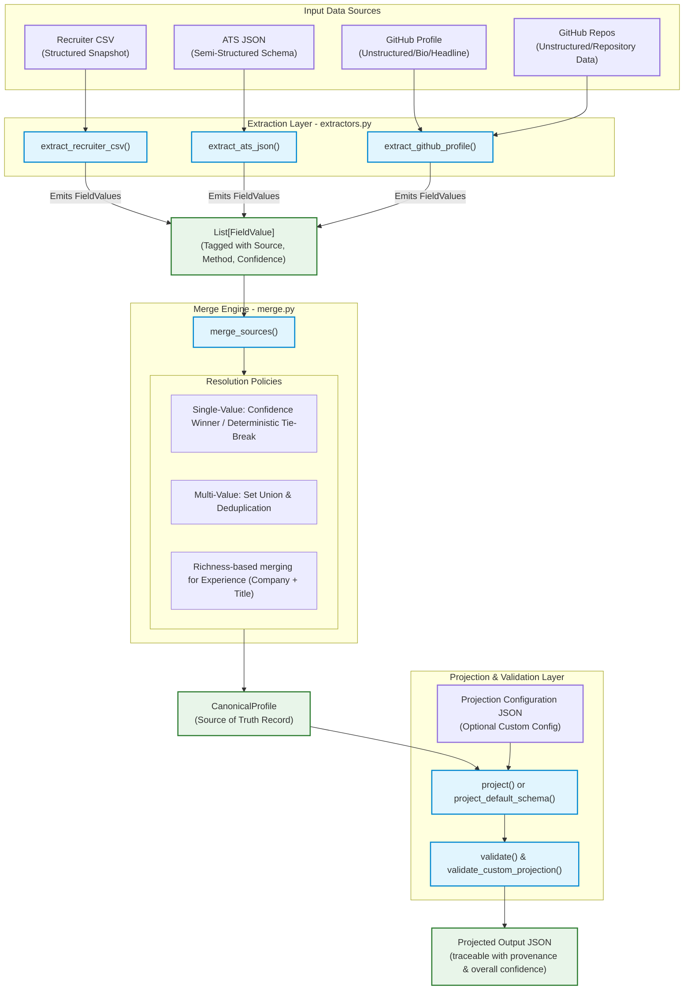

# 🏗️ System Architecture & Design

This document details the high-level system design, architectural principles, and engineering philosophies governing the **Multi-Source Candidate Data Transformer**.

---

## 🎯 Design Principles

The architecture was designed around four core software engineering principles:

1. **Separation of Concerns (SRP)**: Each step of the pipeline is isolated. Extractors only parse raw data and tag it; they do not merge. The merge engine only combines values; it does not format output. The projection layer shapes the output; it does not change the merge result.
2. **Determinism**: Given the same inputs, the pipeline must produce the exact same output. Randomness is eliminated, and tie-breaking rules are explicitly defined.
3. **Auditability & Traceability**: We do not perform black-box data merges. Every value in the final output includes a provenance trail tracking its source, extraction method, and confidence score.
4. **Resiliency (Defensive Design)**: Missing columns in a CSV, missing keys in JSON, or invalid syntax do not crash the pipeline. The system logs warnings, degrades gracefully, and processes whatever valid data is available.

---

## 🗺️ System Architecture

The pipeline follows a clean, single-directional data flow from raw inputs to validated JSON outputs.



---

## 🎯 Confidence Scoring Philosophy

A common anti-pattern in data integration is assigning a single trust score to a source (e.g., "always trust the ATS over a recruiter CSV"). In reality, sources have different levels of reliability for different fields:

* **Recruiter CSVs** are highly reliable for contact details (entered manually to reach the candidate) but quickly become stale regarding professional title, current company, or skills.
* **GitHub** profiles are excellent for validating technical skills (via actual repository languages) but are notoriously outdated for location or current employment.
* **Resumes** provide rich education histories but are highly prone to formatting errors and subjective spin when representing skills.

Therefore, our architecture evaluates confidence **per field, per source**.

### Field-Source Confidence Prior Matrix
The system uses base confidence priors (`FIELD_SOURCE_PRIORS` in [schema.py](file:///c:/Users/lokes/Desktop/eightfold-transformer/schema.py)) as initial trust values:

| Field Name | Recruiter CSV | ATS JSON | GitHub Profile/Repos | Resume (Future) | LinkedIn (Future) |
| :--- | :---: | :---: | :---: | :---: | :---: |
| **full_name** | `0.85` | `0.85` | `0.60` | `0.80` | `0.90` |
| **emails** | `0.90` | `0.85` | `0.40` | `0.70` | `0.30` |
| **phones** | `0.90` | `0.80` | `—` | `0.60` | `—` |
| **location** | `0.50` | `0.50` | `0.40` | `0.70` | `0.85` |
| **headline** | `—` | `—` | `0.60` | `0.50` | `0.90` |
| **skills** | `—` | `—` | `0.85` | `0.70` | `0.60` |
| **experience**| `—` | `0.60` | `—` | `0.80` | `0.85` |
| **education** | `—` | `—` | `—` | `0.85` | `0.80` |
| **links** | `0.70` | `—` | `0.90` | `—` | `0.90` |

### Inferred Discounting Heuristic
Whenever a value is **inferred** rather than directly declared, its confidence prior is discounted:
* **GitHub Repository Languages** are processed as *inferred* skills (since a repo with Python code suggests Python skills, but isn't a direct statement). The prior of `0.85` is discounted by `0.15` to yield `0.70`.
* **Recruiter CSV Experience Snapshot** is discounted by `0.10` since it represents a static, single-point-in-time snapshot rather than a detailed history.

---

## ⚙️ Conflict Resolution & Merging Rules

When multiple values are extracted for a field, the merge engine ([merge.py](file:///c:/Users/lokes/Desktop/eightfold-transformer/merge.py)) decides how they are reconciled using specific policies:

### 1. Single-Value Fields (`full_name`, `headline`, `location`)
* **Policy**: The value with the highest confidence wins.
* **Deterministic Tie-Breaking**: If confidence values are equal, the tie is broken using a static source priority sequence:
  ```python
  SOURCE_PRIORITY = ["recruiter_csv", "ats_json", "linkedin", "resume", "github", "recruiter_notes"]
  ```
  This ensures that identical runs on identical inputs yield identical outputs.
* **Audit Trail**: The winner is written to the profile. Discarded values are appended to the `provenance` list, prefixed with `discarded:` (e.g., `discarded:direct`).

### 2. Multi-Value Fields (`emails`, `phones`)
* **Policy**: Union and de-duplicate. A candidate having multiple emails (e.g., work and personal) is not a conflict. We collect all unique normalized values.
* **Deduplication**: Performed on normalized formats (e.g., lowercased emails, cleaned digits).

### 3. Entity Collections (`experience`, `skills`)
* **Skills**: Aggregated by skill name. The highest confidence encountered across all sources is assigned, and all sources confirming that skill are appended to its `sources` list.
* **Experience**: Deduplicated based on `(company, title)` tuple (lowercased).
  * If a duplicate is found, a **richness metric** (number of non-null attributes like start/end dates or summaries) is computed.
  * The richer entry wins the primary slot. The loser is logged in provenance as `merged-duplicate`.

---

## ⚡ The "Required Twist" — Projection Layer

The project separates the internal representations of candidate data from how they are returned to client applications.

```
       +---------------------------------------------+
       |           Canonical Candidate Record        |
       |  (Strict schema, internal types, provenance) |
       +---------------------------------------------+
                              |
                              v  (Project & Normalize)
             +----------------------------------+
             |         Projection Layer         | <--- Custom Config JSON
             +----------------------------------+
                              |
                              v  (Shape Change)
       +---------------------------------------------+
       |             Projected Output JSON           |
       |   (Restructured fields, renamed paths,      |
       |    custom filters, custom normalizations)    |
       +---------------------------------------------+
```

### Why This Separation Matters:
1. **Source of Truth Integrity**: If custom field naming and transformations were embedded in the merge logic, adding a new API payload would risk corrupting the core merge engine.
2. **Performance**: The pipeline merges multiple records once to create a `CanonicalProfile` and can project it into multiple configurations cheaply in memory.
3. **Robust Schema Evolution**: Changes in client applications only require updating mapping configs, leaving core parser and merge code untouched.
