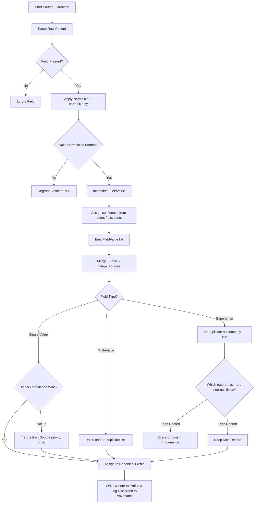

# 📄 Complete Project Documentation

This document serves as the technical reference manual for the **Multi-Source Candidate Data Transformer**. It provides details on module structure, field-by-field workflows, integration procedures, and code execution.

---

## 🎯 Project Objective

In candidate recruitment platforms, candidate profile data comes from multiple sources: resume parsing engines, online profiles (e.g., GitHub, LinkedIn), and manual entry via Applicant Tracking Systems (ATS) or recruiter spreadsheets. 

This project resolves the conflicts arising from inconsistent schemas, stale information, spelling variations, and differing formatting standards. It ingests disparate datasets and outputs a clean, consolidated profile with a clear, auditable trail explaining the origin and trustworthiness of every single field.

---

## 📦 System Modules & Codebase Breakdown

The project follows a modular, layer-oriented architecture. Below is a detailed breakdown of each code module:

### 1. Orchestration Layer
* **[pipeline.py](file:///c:/Users/lokes/Desktop/eightfold-transformer/pipeline.py)**: The entry point. Handles command line parsing, reads source files from disk, wraps each extractor stage in defensive `try-except` blocks to prevent single-source failures from aborting the pipeline, and orchestrates the flow of data.
  * `run_pipeline(candidate_id, sources, custom_config)`: Runs extraction, merging, optional projection, and validation in sequence.
  * `profile_to_dict(profile)`: Safely serializes dataclass structures into dictionary payloads.

### 2. Data Models & Schemas
* **[schema.py](file:///c:/Users/lokes/Desktop/eightfold-transformer/schema.py)**: Defines all data transfer objects (DTOs) and configuration priors.
  * `SourceType(Enum)`: Restricts supported source identifiers (`recruiter_csv`, `ats_json`, `github`, `linkedin`, `resume`, `recruiter_notes`).
  * `ProvenanceEntry(dataclass)`: Model tracking the history of a single field (field name, source, extraction method, confidence score).
  * `FieldValue(dataclass)`: Wraps an extracted data point before conflict resolution.
  * `CanonicalProfile(dataclass)`: Represents the unified, post-merge candidate record.
  * `FIELD_SOURCE_PRIORS`: Dict storing standard confidence values for fields per source.

### 3. Normalization Engine
* **[normalize.py](file:///c:/Users/lokes/Desktop/eightfold-transformer/normalize.py)**: Normalizes incoming field inputs to standard formats.
  * `normalize_phone(raw)`: Trims non-digits, strips leading zeros, and prefixes with country code (defaults to India `+91` if not present).
  * `normalize_email(raw)`: Strips whitespace, lowercases, and validates using a regular expression.
  * `canonicalize_skill(raw)`: Maps raw skill names to standardized versions (e.g., mapping `js`, `reactjs` to `JavaScript`, `React`) or title-cases unknown skills.
  * `normalize_date(raw)`: Best-effort normalization to `YYYY-MM` format.
  * `clean_text(raw)`: Standardizes spacing and normalizes Unicode sequences.

### 4. Extraction Layer
* **[extractors.py](file:///c:/Users/lokes/Desktop/eightfold-transformer/extractors.py)**: Translates raw data into sets of `FieldValue` objects.
  * `extract_recruiter_csv(csv_text)`: Standard CSV parser with defensive cell readings.
  * `extract_ats_json(blob)`: Maps alternative field names (e.g., `candidateName`, `contactEmail`, `employer`) to our canonical paths.
  * `extract_github_profile(profile_json, repos_json)`: Extracts the URL from `login`, profile bio as a headline, and infers technical skills from repository languages.

### 5. Merge Engine
* **[merge.py](file:///c:/Users/lokes/Desktop/eightfold-transformer/merge.py)**: Reconciles all extracted `FieldValue` records into a single `CanonicalProfile`.
  * `merge_sources(candidate_id, all_values)`: Orchestrates the merge logic field-by-field.
  * `_pick_winner(candidates)`: Employs confidence priors and source priority tie-breakers to resolve single-value conflicts.
  * `_merge_skills(values, profile)`: Combines skills while retaining the maximum confidence found and listing all verifying sources.
  * `_merge_experience(values, profile)`: Merges job experiences, deduplicating by company and title, and prioritizing records with richer details.

### 6. Projection & Validation
* **[project.py](file:///c:/Users/lokes/Desktop/eightfold-transformer/project.py)**: Resolves paths (including array indexing and list mappings like `skills[].name`) against the merged record and applies post-processing.
* **[validate.py](file:///c:/Users/lokes/Desktop/eightfold-transformer/validate.py)**: Runs final type-checking, E.164 phone validation, and schema structure validation before data is outputted.

---

## 🔄 Detailed Data Flow & Decision Tree

The diagram below details the exact lifecycle of a field value, from raw file extraction to the final consolidated profile entry.



---

## ⚖️ Evaluation: Pros, Cons, & Trade-offs

Here is a transparent breakdown of the current implementation's engineering design trade-offs:

### Advantages & Pros
* **Highly Auditable**: By keeping a detailed, flattened list of provenance logs (`provenance` key), developers and recruitment professionals can see exactly *why* a particular piece of candidate info was chosen.
* **Separation of Normalization, Merging, and Output Representation**: This design keeps the code easily maintainable. Testing and updates to extraction or merging logic do not break downstream APIs.
* **Lightweight & Fast**: The system uses only standard Python libraries, making it run in milliseconds with zero setup overhead and a minimal memory footprint.

### Disadvantages & Cons
* **Basic Text Processing**: The normalization patterns rely on simple regex checks. In a production system, complex global phone parsing would require a library like Google's `libphonenumber`, and skill matching would benefit from a vector database or semantic taxonomy.
* **Simplified Date Parsing**: The date normalize method handles standard formats like `Jan 2022` or `2022` but would struggle with complex natural-language strings (e.g., "three years ago", "Present").
* **Single-Node Execution**: The current design merges data in memory. Scaling this to process millions of candidates simultaneously would require porting the merge rules to distributed engines (e.g., Apache Spark or dbt/SQL pipelines).

---

## 🛠️ Developer Integration Guide: Adding a New Data Source

To extend the system and add a new input source (e.g., a LinkedIn PDF profile or a Resume Parser output):

### Step 1: Register the Source Type
Add your new source identifier to the `SourceType` enum in **[schema.py](file:///c:/Users/lokes/Desktop/eightfold-transformer/schema.py)**:
```python
class SourceType(str, Enum):
    # ... existing sources
    LINKEDIN_PDF = "linkedin_pdf"
```

### Step 2: Define Base Confidence Priors
In **[schema.py](file:///c:/Users/lokes/Desktop/eightfold-transformer/schema.py)**, add appropriate confidence values for your fields in the `FIELD_SOURCE_PRIORS` dictionary:
```python
FIELD_SOURCE_PRIORS = {
    "full_name":        {"recruiter_csv": 0.85, "linkedin_pdf": 0.90, ...},
    "emails":           {"recruiter_csv": 0.90, "linkedin_pdf": 0.80, ...},
    # ...
}
```

### Step 3: Implement the Extractor
Create a parser function inside **[extractors.py](file:///c:/Users/lokes/Desktop/eightfold-transformer/extractors.py)**. The function must accept your raw input and yield a list of `FieldValue` items:
```python
def extract_linkedin_pdf(pdf_parsed_dict: dict) -> List[FieldValue]:
    out = []
    name = clean_text(pdf_parsed_dict.get("name", ""))
    email = normalize_email(pdf_parsed_dict.get("email", ""))
    
    if name:
        out.append(FieldValue(
            field_name="full_name",
            value=name,
            source=SourceType.LINKEDIN_PDF,
            method="direct",
            confidence=base_confidence("full_name", "linkedin_pdf")
        ))
    if email:
        out.append(FieldValue(
            field_name="emails",
            value=email,
            source=SourceType.LINKEDIN_PDF,
            method="direct",
            confidence=base_confidence("emails", "linkedin_pdf")
        ))
    return out
```

### Step 4: Wire the Extractor into the Pipeline
In **[pipeline.py](file:///c:/Users/lokes/Desktop/eightfold-transformer/pipeline.py)**, update the `run_pipeline` function to include your new extractor within a protective try-except block:
```python
    try:
        if sources.get("linkedin_pdf"):
            all_values.extend(extract_linkedin_pdf(sources["linkedin_pdf"]))
    except Exception as e:
        print(f"[warn] linkedin_pdf extraction failed, skipping: {e}")
```
Add any necessary CLI arguments to the `__main__` entry point block as well to handle parsing files from disk.

### Step 5: Add a Regression Test
Add a unit test to **[test_pipeline.py](file:///c:/Users/lokes/Desktop/eightfold-transformer/test_pipeline.py)** to verify your parser maps data and confidence scores correctly.
