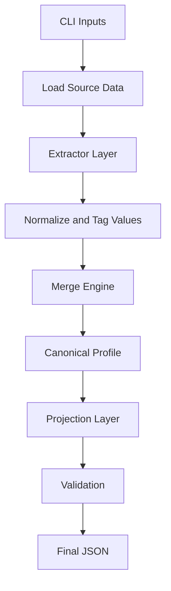
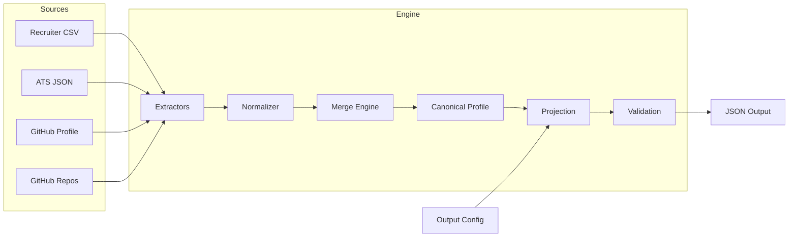
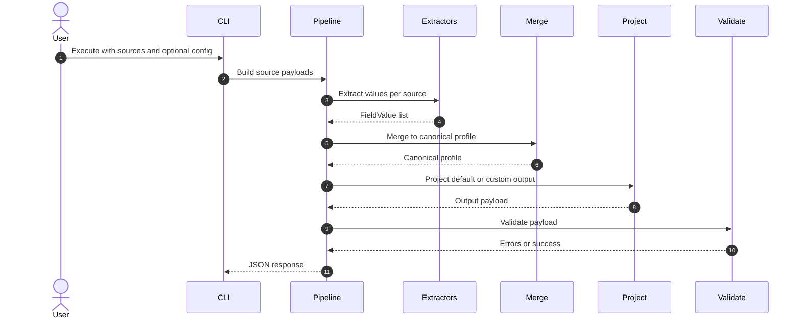

# Complete Project Documentation

This document is the implementation-level technical reference for the Multi-Source Candidate Data Transformer.
It explains modules, responsibilities, integration contracts, execution flow, and practical extension patterns.

## Main Idea and Objective

The project transforms fragmented candidate data into one reliable profile by applying:

1. Source-aware extraction.
2. Deterministic normalization and conflict resolution.
3. Provenance and confidence tracking.
4. Configurable output projection.

## End-to-End Workflow



## Repository Structure

```text
eightfold-transformer/
|-- pipeline.py
|-- README.md
|-- architecture.md
|-- projectdocumentation.md
|-- candidate_transformer/
|   |-- pipeline.py
|   |-- core/
|   |   |-- schema.py
|   |   |-- merge.py
|   |   |-- project.py
|   |   |-- validate.py
|   |-- extractors/
|   |   |-- csv_extractor.py
|   |   |-- ats_extractor.py
|   |   |-- github_extractor.py
|   |-- utils/
|       |-- normalize.py
|-- sample_inputs/
|-- tests/
```

## Module Responsibilities

### Root entry point

pipeline.py:

1. Minimal wrapper that delegates execution to package orchestrator.

### Orchestration layer

candidate_transformer/pipeline.py:

1. Parses CLI arguments.
2. Loads source files.
3. Invokes extractors with defensive error handling.
4. Executes merge, projection, and validation.
5. Emits JSON to stdout or output path.

### Core schema and confidence model

candidate_transformer/core/schema.py:

1. Defines source enum, FieldValue, ProvenanceEntry, CanonicalProfile.
2. Stores field-source confidence priors.
3. Exposes base confidence lookup.

### Merge engine

candidate_transformer/core/merge.py:

1. Groups extracted values by field.
2. Applies deterministic winner selection.
3. Handles list-union fields, skills aggregation, and experience deduplication.
4. Computes overall confidence.
5. Appends provenance for selected and discarded values.

### Projection layer

candidate_transformer/core/project.py:

1. Maps canonical fields into runtime-defined output fields.
2. Supports path expressions such as emails[0] and skills[].name.
3. Applies optional per-field normalization.
4. Supports on_missing policy: null, omit, error.

### Validation layer

candidate_transformer/core/validate.py:

1. Validates default schema output types and formats.
2. Validates custom projection required fields.
3. Surfaces schema issues without crashing core merge logic.

### Extractor layer

candidate_transformer/extractors:

1. csv_extractor.py for structured recruiter CSV.
2. ats_extractor.py for semi-structured ATS JSON.
3. github_extractor.py for unstructured GitHub profile and repository language evidence.

### Utilities

candidate_transformer/utils/normalize.py:

1. Phone normalization to E.164 style.
2. Email normalization and validation.
3. Skill canonicalization.
4. Date normalization to YYYY-MM.
5. Text cleaning.

## System Architecture Diagram



## Data Flow and Execution Internals

### Extraction contract

Each extractor returns a list of FieldValue objects:

1. field_name
2. value
3. source
4. method
5. confidence

This creates a common representation before merge.

### Merge contract

Input: List of FieldValue.

Output: CanonicalProfile with provenance and overall_confidence.

### Projection contract

Input:

1. Canonical profile as dict.
2. Optional custom config.

Output: Projected dict for downstream consumers.

### Validation contract

Input: output dict.

Output: list of validation errors.

## Execution Sequence



## Problem-Solving Approach

1. Convert all source-specific structures into a shared intermediate representation.
2. Normalize early to reduce duplicate and conflict noise.
3. Keep merge logic deterministic and policy-driven.
4. Keep output projection independent from merge internals.
5. Always preserve explainability through provenance.

## Tech Stack and Why It Was Chosen

1. Python 3.9+: readable and fast for assignment-scale data transformations.
2. Standard library only: zero dependency risk and simple execution environment.
3. argparse-based CLI: low overhead and reproducible local runs.

## Crucial Components and Integration Details

1. Field-source priors in schema.py influence conflict winner quality.
2. SOURCE_PRIORITY in merge.py guarantees deterministic tie outcomes.
3. Path evaluator in project.py enables runtime schema flexibility.
4. Validators ensure malformed outputs are surfaced before downstream usage.

## Pros and Cons

### Pros

1. Deterministic and explainable results.
2. Strong traceability through provenance entries.
3. Clean modular boundaries for extension.
4. Easy local run with no dependency installation.

### Cons

1. Heuristic normalization for global data diversity is limited.
2. Skill canonicalization map is intentionally small and curated.
3. Not yet optimized for distributed high-throughput pipelines.

## Integration Guide: Adding a New Source

1. Add source enum in core/schema.py.
2. Add field-source priors in FIELD_SOURCE_PRIORS.
3. Implement extractor in candidate_transformer/extractors.
4. Export function in extractors/__init__.py.
5. Wire extractor call inside run_pipeline.
6. Add tests for extraction and merge behavior.

## Validation and Quality Gates

Current quality coverage includes:

1. Conflict resolution behavior.
2. Deterministic tie breaking.
3. Multi-value union semantics.
4. Normalization checks for phone and dates.
5. Projection on_missing policy behavior.
6. End-to-end execution for default and custom output.

## Summary

This implementation delivers a complete and explainable candidate transformation pipeline with robust structure, deterministic behavior, rich traceability, and configurable output projection suited for the assignment requirements.
